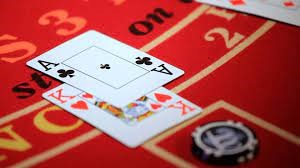

# Simple Application - Blackjack Game
As stated briefly in the description, this is a very simple text input & output Blackjack game that I created in **Semester 2** of my first year of university. It was for the '**Simple Application**' assignment for the module '**Introduction to Programming**'. As well as being a fully-working Blackjack game, it also has some cool custom features/ functionality that I added myself. If you wish to download or clone this repository, please read the 'Game Instructions' section of the documentation below. 

  

  
## Documentation

### Project and My Aims
The programming project that I chose for the Simple Application assessment was the freestyle game, and in this case, a text-input and output version of the card game, Blackjack. I chose this particular game for the project because I felt that it was not overly complex, meanwhile being complex enough to show understanding of basic coding concepts to develop simple application. Nonetheless, I was still able to add some cool features to meet the criteria, and also make for a better user experience.

### Game Instructions

  **Running the code from BlueJ**
  
  Navigate to the class-view window, which should have all classes laid out visually for the user to see. Right click the ‘Blackjack’ class (as this contains the main method   for the code to run) and click ‘Compile’. Once compiled, right click a second time and click ‘void main (String[] args)’. The game should open on a separate window.

  **Running the code from Eclipse**

  Navigate to the Package Explorer on the left of the screen. Expand ‘src’  and ‘blackjackpack’ to reveal the classes, and right click the Blackjack.java class. Select ‘Run     as’, then from its drop-down menu, click ‘1 Java Application’ and the game should commence in the runtime environment at the bottom of the screen. Alternatively, there is a   ‘Run’ button located on the top of the screen, under the ‘Search’ tab, which is more convenient for simpler programs.

1. Now that the game is up and running, the dealer will give an appropriate greeting depending on the time of day, then will inform you that you have £500 to play with. The dealer will then ask much money you would like to bet. The starting bet amount can be anything from 0 to 500 pounds. Once you have decided how much you are going to bet, type it into the terminal and press Enter.

2. After entering the bet amount, you will be given two cards, both of which will be completely random in suit and value. The total value of your hand is automatically calculated, and is displayed below the cards. Underneath your total hand value, the dealer has one of their cards ‘showing’ (printed to a String) whereas the other one is not yet revealed. You are then given a choice to hit or stand. If you wish to hit (receive another card), you can either type ‘hit’ or the number ‘1’ into the terminal. If you wish to stand, you can type ‘stand’ or ‘2’ into the terminal. Making any of the letters capital in ‘hit’ or ‘stand’ is fine.

3. If you chose to hit, you will be given another card, which will add to your total hand value. There is no limit to the number of times you can hit, therefore, in a scenario where you have relatively low cards, you can keep hitting so that you can get as close to 21 as possible. However, if you hit, and your hand value goes over 21, you are then bust, and lose the round. Once you are happy with your hand value, type ‘stand’ or 2 into the terminal. The game will move on straight away and you will not receive any more cards.

4. After standing, the dealer’s second card is revealed, and as long as their hand value is less than 17, they will keep drawing cards until they reach or surpass this. If the dealer draws some cards and their hand is higher than yours, but equal to or lower than 21, they win. If they keep drawing cards and go over 21, they are bust and you win. Another outcome would be if you had a hand value of 19, for example, and the dealers hand reaches 18, you would win. Just like in normal Blackjack, a loss means you lose all money bet that round, and a win means that you get double your bet amount back. Finally, if there is a push (a tie) your bet amount is returned to your balance.  

5. Lastly, after winning, losing, or resulting in a tie, the dealer will then ask if you would like to play another round. You can either type 1 for ‘Yes’, or 2 for ‘No’. If you choose to play another game, the cards are returned to the deck and another round will start, factoring in your wins/ losses. However, if you do not wish to play anymore, entering 2 will close the text input and thus end the game. 

### How the Code/ Main Classes Work

#### Enumeration Classes
Since this is a card game, creating the necessary classes for the game was not too difficult. I knew that I needed a card object, a deck object (an ArrayList of cards) and a class to put the Blackjack game-logic in. In this case, the only relevant information for a card is its suit and value (value being slightly more important). The easiest way to create the sets of suits and values was using two enumeration classes, ‘Suit’ and ‘Value’. Because suits don’t matter too much in Blackjack specifically, I left the enum as a simple list of the suits. However, for Value, I decided that initialising and returning the values as integers, in the enum class, would be more far more concise than writing a switch statement with 13 different cases in the Deck class.  

#### Card Class
This class defines one singular card, meaning it must use the enums, Suit and Value. I started by creating a new private Suit (enum) called ‘suit’, and a private Value called ‘value’. The identifiers must be lowercase, otherwise Java would have issues differentiating them from the enum class, when used in statements. Next, I had to create three methods for the cards. 
The first one was the card constructor, which defines that every card created must have a suit, and a value. The second was the ‘toString’ method, which textually represents the card object by returning the value, e.g., ‘KING’, and the suit, e.g., ‘HEARTS’ to a string. I stated that the word ‘of’ should always be in the middle, so that when a card is returned, it would say e.g., ‘KING of HEARTS’. This method is also an example of overriding, as it’s using the Card class’s functionality to convert cards to strings. Lastly, the final method is ‘getValue’. The purpose of which, is to return the numerical value of a card, so that hand values can be calculated, and recalculated when the player and/or dealer hits.

#### Deck Class

The deck class is an ArrayList of card objects. The reason that it had to be an ArrayList and not an array is because the length of ArrayLists can be changed, whereas a normal array must have a fixed length, which would ultimately make my chosen method of shuffling impossible. I created the deck by making a new private ArrayList of cards called ‘deckCards’, which is the instance variable of the class. 
I then had to create a constructor method so that a new deck of cards can be created at the start of each game. The way that I defined the number of cards that should be in a deck was via iteration using for loops. The for loops state that for every suit, there should be a full set of values (4 x 13).  Once the 52 cards were created, I was then able to add them to deckCards. The final part of the deck constructor was including a reference to the shuffle method, outside of both for loops. 
The shuffle method consists of a separate, temporary deck which is also an ArrayList of cards. I used the Java utility: ‘Random’ to generate a random number of cards (randomCardIndex) to be removed from the original deck, which can be any number from 0 to 51. This number of cards is then to be added to the temporary one, thus changing the ordering. Once this has occurred, the temporary deck then becomes equal to the original deck, meaning the cards have been shuffled successfully. There are also various one-line methods for removing, adding and drawing cards from the deck. As in real life, operations on the deck are to shuffle, draw a card, and put cards back into the deck.

#### Hand Class
I created the hand class to simplify the Deck class, as I realised that the prior version was too cluttered with unnecessary methods. The class consists of a new ArrayList of cards called ‘cards’. This is used in the drawFrom method, which draws a single card from deckOfCards in the Blackjack class when called upon.  Lastly, the method ‘returnCardsToDeck’ returns all cards used in a round back to the deck, and also the ‘toString’ method returns a list of the cards in both the players’ and dealers’ hands.

#### Blackjack (main) Class
The Blackjack class contains all game logic and add-ons that make the game more enjoyable/ convenient. Firstly, I imported the scanner from Java utilities, and created a new one called ‘playerInput’, which scans for input from the player, allowing them to play the game as they intend. Next, I made it so that when the player starts up the game, the dealer will greet them appropriately, depending on the time of day that the game is played. I did this using three variables and the ‘getHours’ Java function. The variable ‘today’ defines the date that the game is played on, and the variable ‘time’ uses the getHours function to get the specific hour of the ‘today’ variable. The ‘timeOfDay’ variable is left undefined since it will change depending on the time of day. For example, if the game is played before noon but after midnight, the dealer greets the player with ‘Good morning, and welcome to Blackjack!’. If the player was to play the game after midday, the word ‘morning’ changes to ‘afternoon’, and finally if the time the game is played is later than 8pm, but before midnight, the word changes to ‘evening’. I added this feature to make the game more realistic.

Following this, I created a new deck of cards called ‘deckOfCards’, which will be the playing deck in the game. Subsequently, I had to create a new hand for the player and dealer. There are two Boolean arguments in the class, one being ‘playerHasLeft’, which becomes true when the player chooses to not play any further, and ‘endRound’ which is self-explanatory. I then made a double constant called ‘INITIAL_BALANCE’ which will always start off as £500.0; the dealer informs the player of this after the greeting message. The other double in the class would of course be the ‘playerBet’, which is equal to 0 until the player places a bet. After these declarations, the game loop initiates. The condition of the while loop is that the player can continue playing unless they choose to leave, or if their balance drops to 0. The first if statement in the loop states that if the player’s bet is greater than their balance, the scanner closes and the player is ‘kicked out of the casino’. If the player bets normally, the loop continues and the dealing commences. Cards are drawn using the drawFrom method in the Hand class, which is derived from the draw method in the Deck class.

Next, is the ‘showHand’ method, which prints whatever cards are in the player’s hand to a string, and also informs the player of their total hand value. One of the dealer’s cards are revealed below, while the other remains hidden. The dealer then asks the player whether they would like to hit or stand. This is where the ‘PlayerInput’ class comes in. Within the PlayerInput class, I created a new scanner called ‘answerInput’, and an enum constant containing the words ‘hit’ and ‘stand’. 

I then wrote a getAnswer method (still within the PlayerInput class) which returns ‘HIT’ if the player types out the word, or enters the integer 1. Similarly, if ‘2’ or ‘stand’ are typed, the console knows that the player wants to stand. If the player was to type anything else, it would throw an IllegalArgumentException, with the message “That’s not a valid answer!”. When the player comes to a decision, there are various outcomes, which I factored in using simple if statements. For example, if the player hits and their hand value ascends 21, they are bust, and lose the money that they wagered. Assuming that neither players are bust, the if statements must have the condition: “endRound == false” since nobody has lost yet. Using that condition, along with comparing player and dealer hand values, I was able to implement if statements in the cases that the player wins, loses or ties. 

If the player wins, they are given double their bet amount back, which adds to their total balance for future rounds, just like in normal Blackjack. Another cool feature that I added using a simple if-else statement is a different compliment for the players winning hand e.g., for 21, the word is ‘Spectacular!!’, whereas for 20, it’s ‘Fantastic!’ etc. If the player loses due to having a weaker hand, the same rule applies for going bust. Regardless of the outcome, the ‘endOfRound’ method initiates afterwards. This involves the player’s and dealer’s cards being returned to the deck, and the dealer asking the player if they would like to play again. 
This answer is only integer based, meaning the player must respond with 1 for ‘Yes’ and 2 for ‘No’. If they answer ‘Yes’ and still have money, the game loop repeats, otherwise, when the loop breaks, it will not repeat & the player will be informed that the game is over. In the case that the player enters ‘No’, the scanner closes and the dealer says the end-of-game message: “Fair enough, have a good rest of your”, followed by the appropriate time of day. Finally, depending on whether the final player balance is above or below the initial balance, the dealer will either congratulate or sympathize with the player.

### Testing
Finding and fixing errors was largely successful. The way in which I did this was mostly by making small changes to the game logic, then hitting ‘CTRL + S’ and recompiling the game, which worked for solving syntax errors. However, I later noticed that it is possible to introduce errors in the future without realising it, including breaking existing functionality. Therefore, a set of tests for the existing functionality (using JUnit) would be useful, and would be run after every code change to ensure that nothing gets broken. 
One example of a logic error that I fixed, was an instance where the player chooses ‘No’, when asked to play again. As well as printing the reply to that answer, the game would also print the message that should only be printed if the player bets more than they can afford. This is of course not what I intended, so to fix it, I created a Boolean called playerHasLeft, which becomes true when the player chooses to leave. I then nested both end-of-game statements inside an if statement, wit the condition that the player has not left (if !playerHasLeft), and changed the second statement to an else-if. 
### Reflection
My original aim was to create a Graphical User Interface Blackjack game, however after some evaluation I decided that a simpler version of the game was more feasible for the amount of time given for the project. With hindsight, I realised that I should have split up the main method into smaller chunks i.e., separate components. These would then have been more easily testable and could have been tested as I wrote the code e.g., using a test-driven development approach. I will employ this recognised way of development in future projects. 
On the other hand, for a simplistic text-input-output version of the popular card game, I feel as if I have made the game fairly realistic. There are various things I could have done better, such as create a method that allows ‘Yes’, ‘No’, ‘1’ or ‘2’ to be typed at the end of the game, instead of just integers. Furthermore, I could have set up some kind of class that kept a scoring board. Overall, however, I am satisfied with the final state of the game.

### References
1.	https://youtu.be/xLhgqPUHoVs
2.	https://stackoverflow.com
3.	https://beginnersbook.com/2014/01/method-overriding-in-java-with-example/

